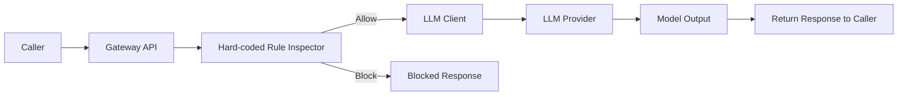
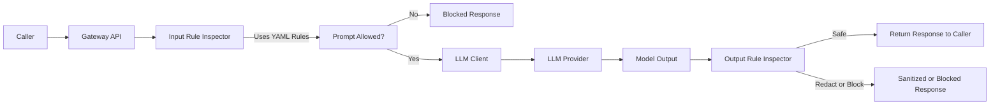
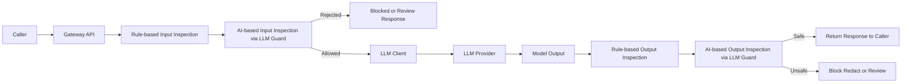
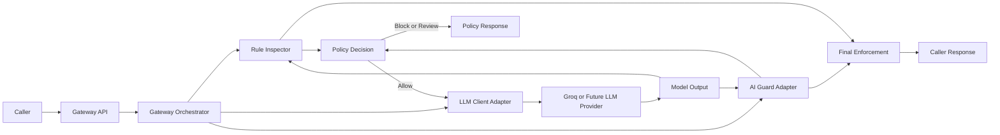

# Secure LLM Gateway — Engineering README

Secure LLM Gateway is a FastAPI-based proxy that inspects prompts and model responses, applies security policies, and blocks or sanitizes unsafe interactions to reduce OWASP-style LLM risks.

## Overview

The service is designed as a control layer in front of an LLM client rather than a thin pass-through API. The central idea is that both user input and model output are part of the attack surface, so the gateway must validate, inspect, and enforce policy before returning a response to the caller.

This document focuses on architecture evolution, design choices, and the reasoning behind the current shape of the system. Mermaid diagrams are used because GitHub Markdown supports Mermaid code blocks directly, which makes architecture diagrams readable and maintainable inside repository documentation.[1][2]

## Current endpoint shape

| Endpoint | Purpose |
|---------|---------|
| `GET /` | Basic root/liveness response. |
| `GET /health` | Operational health response with uptime, app version, prompt version, and inspector readiness. |
| `GET /metrics` | Metrics endpoint for gateway observability. |
| `POST /chat` | Main secured gateway execution path. |

## Design goals

- Place a security control point between clients and the model call path.
- Treat both prompt input and model output as inspectable surfaces.
- Keep policy logic externalized and evolvable rather than hard-coded forever.
- Support operational visibility through health, metrics, and structured decisions.
- Keep the system extensible so LLM clients and AI guard layers can be swapped with minimal disruption.

## Architecture evolution

A useful way to understand the system is as a sequence of deliberate architecture upgrades. Capturing architecture as an initial state plus later evolutions is a recommended documentation pattern because it explains not just what exists now, but why the current design emerged.[3][4]

### Stage 1 — hard-coded rule inspection before model call

The first version used a hard-coded rule inspection layer, primarily regex-based checks, before sending requests to the LLM client. The flow was simple and practical: inspect input, call the model if allowed, and return the model response to the caller.



#### Why this design made sense

This was the fastest route from blank repository to a meaningful security MVP. It established the key product idea early: the model should not be directly exposed, and requests should first pass through a security decision layer.

#### Limitations

- Rules were not easy to evolve without code changes.
- Inspection was focused primarily on request input.
- Output handling was too trusting for a security-focused gateway.

### Stage 2 — YAML-based rule inspection for input and output

The next step replaced hard-coded inspection logic with YAML-backed rules and extended inspection to include model output. This moved the system toward policy-as-configuration and made it easier to change security behavior without repeatedly editing route logic.



#### Why this was an improvement

YAML-backed rules improved maintainability by separating policy definition from request handler code. Adding output inspection also aligned the design better with real LLM risk: a system can be compromised not only by harmful input, but also by unsafe or policy-violating generated output.

#### Design implications

- Prompt and rule changes became easier to track and review.
- The gateway evolved from a request filter into a bidirectional inspection layer.
- Configuration became a first-class engineering concern.

### Stage 3 — AI-based inspection added alongside rule-based inspection

The next evolution introduced an AI-based inspection layer in addition to the YAML-driven rule checks. LLM Guard was used to inspect both user prompt input and LLM output for security risks, giving the system a hybrid inspection model: deterministic rules plus model-assisted analysis.



#### Why hybrid inspection was chosen

Deterministic rules are strong for explicit patterns, known attack signatures, and predictable enforcement. AI-based inspection is useful when risk cannot be captured well with static patterns alone, such as semantically phrased prompt injection attempts or suspicious output shapes that do not match a simple regex.

#### Trade-offs

| Choice | Benefit | Cost |
|-------|---------|------|
| Rule-based inspection | Deterministic, fast, explainable | Misses some contextual or semantic risks |
| AI-based inspection | Better semantic coverage and adaptability | Adds complexity, latency, and another dependency |
| Hybrid model | Better coverage and layered defense | Requires clearer orchestration and debugging |

### Stage 4 — plug-and-play integration for guards and LLM clients

The next design step focused on extensibility. The system was shaped so that future security guard implementations could be swapped in, and different LLM clients could be used with minimal disruption; Groq is the current LLM client path, but the architecture is intended to avoid hard-coding the service to one provider forever.



#### Why extensibility matters here

A security gateway becomes more valuable when it is not tightly coupled to a single model vendor or a single inspection library. A plug-and-play shape supports experimentation, migration, and future hardening without forcing a redesign of the API surface each time a new provider or guard needs to be introduced.

## Current design decisions

### Decision 1 — gateway as security boundary

The service is intentionally designed as a gateway rather than direct model access. This creates a place to apply validation, inspection, policy enforcement, and future audit logging around every request and response.

### Decision 2 — inspect both input and output

The design does not assume that only user prompts are risky. Model output is also inspected because unsafe behavior can emerge after the model call, and security controls should account for both directions.

### Decision 3 — configuration over hard-coded policy where possible

Rules and prompt metadata are moving into YAML-backed configuration so the policy surface is easier to evolve, version, and reason about. This is especially important for prompt versioning and explainable policy changes.

### Decision 4 — middleware for cross-cutting concerns

Authentication, rate limiting, and request context are treated as middleware concerns rather than embedded route logic. This keeps request handlers more focused on gateway orchestration and policy flow.

### Decision 5 — operational endpoints as first-class features

`/health` and `/metrics` are treated as part of the service contract rather than optional extras. For a gateway intended to look production-minded, operational visibility is part of the design, not just an implementation detail.

### Decision 6 — evolve by layering, not rewriting

The system evolved through layered improvements: hard-coded rules, then YAML rules, then output inspection, then AI-based inspection, then pluggable components. This incremental path reduced rewrite risk while steadily improving realism and security coverage.[3][5]

## Request lifecycle in the current system

1. A client calls `/chat` with a validated request body.
2. Middleware applies request context, authentication, and rate limiting.
3. The gateway orchestrator loads resources and system prompt configuration.
4. Input inspection runs through rule-based and optionally AI-based guards.
5. If allowed, the request is sent through the active LLM client.
6. The model output is returned to output inspection layers.
7. Final enforcement decides whether to allow, block, redact, or review the response before returning it.

## Operational notes

The current codebase keeps the app entry point and router wiring in `main.py`, which is acceptable at the current project size. Operational endpoints can remain grouped via a router now and later be moved into a dedicated module once the app expands further.

## Future engineering improvements

- Move operational routes into a dedicated module once the app grows.
- Add structured audit events for non-allow decisions.
- Make guard implementations discoverable through cleaner interfaces or adapters.
- Expand tests around `/health`, `/metrics`, strict request schemas, and policy decisions.
- Document guard/provider contracts more formally as lightweight ADRs or interface notes.[6][5]

## Local development

```bash
pip install -r requirements.txt
uvicorn app.main:app --reload
```

## Suggested reading order

1. `main.py` for application wiring, middleware, and endpoint registration.
2. `app/config/` for prompt and rule configuration.
3. Gateway orchestration and inspector components for policy flow.
4. Middleware and smoke tests for expected behavior.